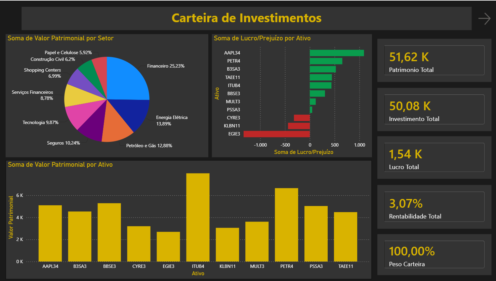
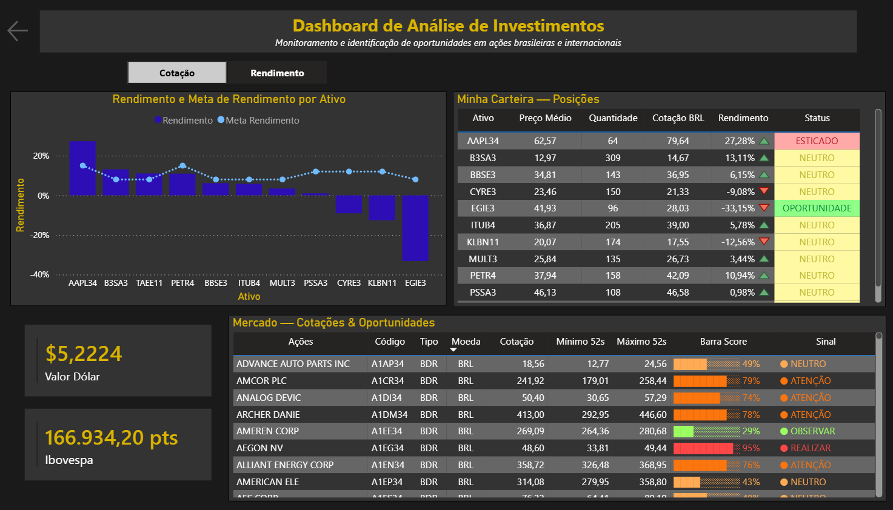

# 📊 Dashboard de Análise de Investimentos — Power BI

## Objetivo

Dashboard para acompanhamento de carteira de investimentos (ações brasileiras  e BDRs), com análise de patrimônio, rentabilidade por ativo, exposição 
setorial e monitoramento de oportunidades no mercado através de um sistema de score e sinalização.

## Ferramentas

- Power BI
- DAX
- Power Query
- Google Sheets (fonte de dados da carteira)
- Yahoo Finance (cotações e indicadores de mercado)

## Estrutura do Dashboard

### 1️⃣ Carteira de Investimentos
- **KPIs principais:** Patrimônio Total, Investimento Total, Lucro Total, Rentabilidade Total e Peso da Carteira
- **Distribuição por setor:** participação percentual de cada setor (Financeiro, Energia Elétrica, Petróleo e Gás, Seguros, Tecnologia, etc.)
- **Lucro/Prejuízo por ativo**
- **Valor patrimonial por ativo**

### 2️⃣ Análise de Investimentos
- **Rendimento vs. Meta de Rendimento** por ativo, com toggle entre Cotação e Rendimento
- **Minha Carteira — Posições:** preço médio, quantidade, cotação atual, rendimento e status (Esticado / Neutro)
- **Mercado — Cotações & Oportunidades:** varredura de ações e BDRs, com mínima/máxima de 52 semanas, score e sinal (Neutro / Atenção / Observar / Realizar)
- **Indicadores complementares:** cotação do dólar e Ibovespa

## Principais análises

- Patrimônio total e rentabilidade da carteira
- Exposição setorial
- Cotação em tempo real (BRL e USD)
- Maior alta/queda entre os ativos
- Radar de mercado com score de oportunidade

## 🔗 Dashboard interativo
[Acessar dashboard](seu-link-aqui)

## Preview

**Carteira de Investimentos**

**Análise de Investimentos**

## Estrutura do repositório

├── dashboard.pbix
├── imagens/
│   ├── carteira.png
│   └── analise.png
└── README.md

## Contato
[LinkedIn](seu-link) | [E-mail](seu-email)
